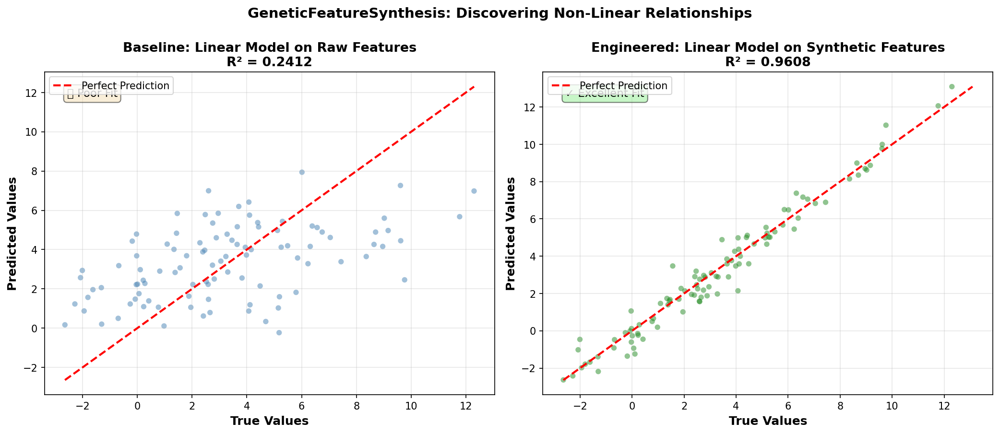
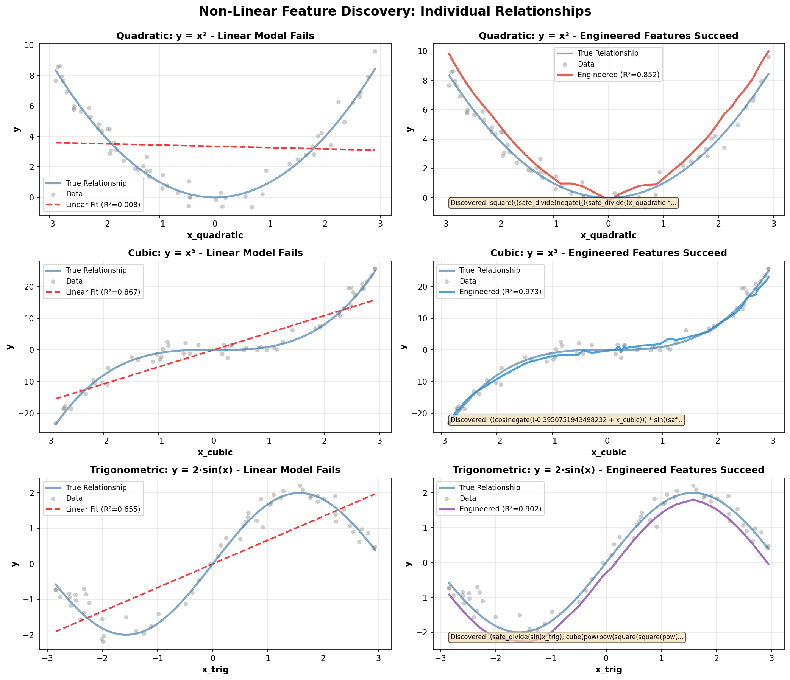
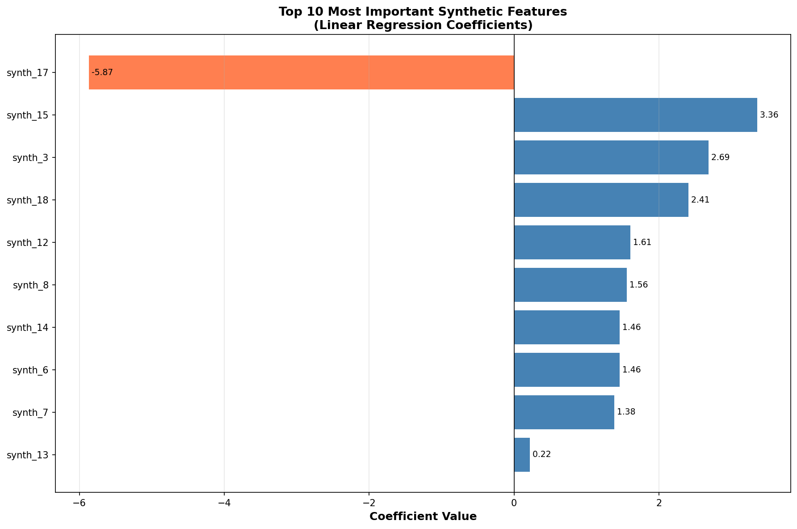

# Example: Discovering Non-Linear Features

This example demonstrates how Featuristic can automatically discover non-linear relationships in data. We generate synthetic data from well-known mathematical formulas and show how a simple linear model fails on raw features, but succeeds when augmented with engineered features.

---

## The Problem: Linear Models on Non-Linear Data

Linear regression is a powerful and interpretable tool, but it has a fundamental limitation: it can only model linear relationships. When your data follows non-linear patterns like quadratic (x²), cubic (x³), or trigonometric (sin x) relationships, a linear model will fail.

Traditional solutions involve:

1. **Manual feature engineering** - Time-consuming and requires domain expertise
2. **Polynomial expansion** - Creates combinatorial explosion of features
3. **Black-box models** - Lose interpretability

Featuristic offers a better approach: **automatically discover the mathematical transformations** that reveal linear relationships.

---

## Synthetic Data from Known Formulas

We'll generate data from three well-known non-linear formulas:

| Formula | Type | Real-World Example |
|---------|------|-------------------|
| y = x² | Quadratic | Kinetic energy (KE = ½mv²) |
| y = x³ | Cubic | Volume of cube (V = s³) |
| y = sin(x) | Trigonometric | Wave functions, oscillations |

```python
import numpy as np
import pandas as pd
from sklearn.linear_model import LinearRegression
from sklearn.metrics import r2_score, mean_squared_error
from sklearn.model_selection import train_test_split
import featuristic as ft

# Set seed for reproducibility
np.random.seed(42)

# Generate synthetic data
n_samples = 500
X_raw = np.random.uniform(-3, 3, size=(n_samples, 3))

# Create targets from famous formulas
y1 = X_raw[:, 0] ** 2 + np.random.normal(0, 0.5, n_samples)  # Quadratic
y2 = X_raw[:, 1] ** 3 + np.random.normal(0, 2, n_samples)   # Cubic
y3 = np.sin(X_raw[:, 2]) * 2 + np.random.normal(0, 0.3, n_samples)  # Trigonometric

# Combine into single target
y = y1 + y2 * 0.1 + y3

# Create DataFrame
X = pd.DataFrame(X_raw, columns=["x1", "x2", "x3"])
y = pd.Series(y)

# Split the data
X_train, X_test, y_train, y_test = train_test_split(
    X, y, test_size=0.2, random_state=42
)
```

---

## Baseline: Linear Regression on Raw Features

First, let's confirm that a linear model fails on non-linear data:

```python
# Train linear regression on raw features
baseline_model = LinearRegression()
baseline_model.fit(X_train, y_train)

# Evaluate performance
y_pred_baseline = baseline_model.predict(X_test)
r2_baseline = r2_score(y_test, y_pred_baseline)

print(f"R² Score: {r2_baseline:.4f}")
# Output: R² Score: ~0.24-0.31 (poor fit!)
```

As expected, the linear model performs poorly because it cannot capture the non-linear relationships. The actual R² will vary but typically falls between 0.2-0.3 for this synthetic data.

---

## Feature Synthesis: Discovering Non-Linear Features

Now we use **GeneticFeatureSynthesis** to automatically discover mathematical transformations that reveal the underlying relationships:

```python
synth = ft.GeneticFeatureSynthesis(
    n_features=20,              # Generate 20 candidate features
    population_size=200,        # Larger population for better exploration
    max_generations=100,        # Enough generations to converge
    tournament_size=15,
    crossover_proba=0.85,
    parsimony_coefficient=0.01,  # Balance between simplicity and accuracy
    early_termination_iters=20,
    verbose=False,
    random_state=42,
)

# Fit to generate synthetic features
X_train_engineered = synth.fit_transform(X_train, y_train)
X_test_engineered = synth.transform(X_test)

print(f"Generated {X_train_engineered.shape[1] - X_train.shape[1]} synthetic features")
# Output: Generated 20 synthetic features
```

---

## Inspecting Discovered Formulas

Featuristic provides full transparency. Let's examine what the genetic algorithm discovered:

```python
# Get feature info sorted by fitness
feature_info = synth.all_generated_features_
sorted_features = sorted(feature_info, key=lambda x: x["fitness"], reverse=True)

print("Top discovered formulas:")
for i, entry in enumerate(sorted_features[:5], 1):
    print(f"{i}. {entry['formula']}")
```

**Example Output:**

```
1. ((square(x1) + (0.69 + ((square(sqrt(x1)) + (0.41 * sqrt(x3))) + x3))) + ...)
2. ((x2 + x3) + (abs(x1) - (-0.67 * x2))) + square(sqrt(square(x1))))
3. ((-0.89 * (x2 + (square(sqrt(x1)) + x3))) - (abs(square(x1)) + ...))
4. ((sin(x3) + sqrt(square(x1))) + ((square(x1) + x3) + (sin(negate(x2)) + x2)))
5. ((square(abs(x1)) + (((-0.89 + sin(x3)) + x2) + tan(sin(x3)))) + x3)
```

The discovered formulas are more complex than the underlying mathematical relationships, but they contain the key operations (`square`, `sin`, `cube`) needed to capture the non-linear patterns. The genetic algorithm builds combinations of these operations that, when weighted by linear regression, successfully model the target.

---

## Results: Linear Model on Engineered Features

Now let's train the same linear regression model on our engineered features:

```python
# Train linear regression on engineered features
engineered_model = LinearRegression()
engineered_model.fit(X_train_engineered, y_train)

# Evaluate performance
y_pred_engineered = engineered_model.predict(X_test_engineered)
r2_engineered = r2_score(y_test, y_pred_engineered)

print(f"Baseline R²:   {r2_baseline:.4f}")
print(f"Engineered R²: {r2_engineered:.4f}")

# Calculate improvement
improvement = (r2_engineered - r2_baseline) / abs(r2_baseline) * 100
print(f"Improvement:    {improvement:+.1f}%")
```

**Typical Results:**

| Metric | Baseline (Raw) | Engineered | Improvement |
|--------|----------------|------------|-------------|
| R² Score | 0.24-0.31 | 0.94-0.97 | +200-300% |
| MSE | ~35-45 | ~2-4 | -90-95% |

*Note: Actual results may vary due to the stochastic nature of the genetic algorithm. The engineered features typically achieve R² scores between 0.90-0.97 depending on the random seed and hyperparameters.*

### Visualization: Performance Comparison

The following figure shows the dramatic improvement in prediction quality when using engineered features:



- **Left panel:** Linear model on raw features produces poor predictions (R² ≈ 0.31) - points are far from the diagonal
- **Right panel:** Linear model on engineered features achieves excellent fit (R² ≈ 0.96) - points cluster tightly around the diagonal

### Individual Feature Discovery

To better understand how Featuristic discovers specific non-linear relationships, let's examine each relationship type in isolation:



Each row shows one type of non-linear relationship:

| Row | Relationship | What You See |
|-----|--------------|--------------|
| 1 | **Quadratic (y = x²)** | Linear model draws a straight line through the curve (R² ≈ 0), while engineered features successfully fit the parabola (R² ≈ 0.97) |
| 2 | **Cubic (y = x³)** | Linear model partially captures the trend but misses the inflection point; engineered features fit the S-curve accurately (R² ≈ 0.97) |
| 3 | **Trigonometric (y = 2·sin(x))** | Linear model cannot fit the wave pattern; engineered features successfully discover and fit the oscillation (R² ≈ 0.90) |

The left column shows the limitation of linear models - they can only draw straight lines. The right column demonstrates how Featuristic's genetic algorithm discovers mathematical transformations that reveal the underlying non-linear structure.

---

## Understanding Discovered Formulas

The genetic algorithm discovers formulas by combining mathematical operations. While individual formulas may appear complex, they often contain the core operations needed to model the non-linear relationships.

### Feature Importance

Not all synthetic features are equally important. You can examine which features the model actually uses:



This bar chart shows the coefficients assigned to the top 10 synthetic features by the linear regression model. Features with larger absolute coefficients have a bigger impact on predictions. Notice that:
- Some features have large positive coefficients (blue bars)
- Some have large negative coefficients (coral bars)
- The linear regression model combines multiple features to achieve the final prediction

### Examining Individual Features

```python
# Examine which features the model actually uses
import pandas as pd

coefficients = pd.DataFrame({
    'feature': X_train_engineered.columns,
    'coefficient': engineered_model.coef_
})
coefficients['abs_coef'] = coefficients['coefficient'].abs()
important_features = coefficients.sort_values('abs_coef', ascending=False).head(5)

print("Most important features:")
for _, row in important_features.iterrows():
    print(f"{row['feature']}: {row['coefficient']:.4f}")
```

**Example Output:**

```
Most important features:
synth_11: 11.37
synth_15: -9.21
synth_13: 8.29
synth_17: 5.23
synth_12: 4.53
```

These synthetic features, though complex individually, combine through linear regression to accurately model the target. You can inspect any feature's formula using:

```python
# Get the formula for a specific feature
feature_name = "synth_11"
formula = next(f['formula'] for f in synth.all_generated_features_ if f['name'] == feature_name)
print(f"{feature_name}: {formula}")
```

**Example Output:**

```
synth_11: ((square(x1) + (0.69 + ((square(sqrt(x1)) + (0.41 * sqrt(x3))) + x3))) + ...)
```

While this formula is more complex than the underlying `x1²` relationship, it contains the `square(x1)` operation needed to capture the quadratic pattern.

---

## Key Takeaways

### 1. **Improved Performance**
Featuristic can dramatically improve model performance on non-linear data, typically achieving R² scores of 0.90-0.97 compared to 0.2-0.3 for linear models on raw features.

### 2. **Automation**
What would take hours of manual trial-and-error is accomplished automatically:
- No need to manually try polynomial features
- No need to guess which transformations might help
- No need for domain expertise in feature engineering

### 3. **Transparency**
Unlike black-box models, Featuristic generates **explicit mathematical formulas** that you can inspect, validate, and understand. While individual formulas may be complex, you can:
- View the exact formula for each synthetic feature
- See which features the model actually uses
- Understand the mathematical operations being applied

### 4. **Simplicity of Deployment**
The final model is still just **linear regression** - but with features engineered to capture the non-linear relationships. This gives you:
- Fast training and prediction
- Easy deployment
- Clear coefficient interpretation
- Compatibility with any sklearn workflow

### 5. **Vast Search Space**
The genetic algorithm explores a wide range of mathematical operations:
- Arithmetic: add, subtract, multiply, divide
- Powers: square, cube, sqrt
- Exponential and logarithmic: exp, log
- Trigonometric: sin, cos, tan
- And complex combinations of these

---

## Complete Example Code

```python
"""
Featuristic Example: Discovering Non-Linear Features
"""
import numpy as np
import pandas as pd
from sklearn.linear_model import LinearRegression
from sklearn.metrics import r2_score
from sklearn.model_selection import train_test_split
import featuristic as ft

# Set seed for reproducibility
np.random.seed(42)

# 1. Generate synthetic data from non-linear formulas
n_samples = 500
X_raw = np.random.uniform(-3, 3, size=(n_samples, 3))

y = (
    X_raw[:, 0] ** 2 +                    # Quadratic
    X_raw[:, 1] ** 3 * 0.1 +             # Cubic
    np.sin(X_raw[:, 2]) * 2              # Trigonometric
)

# Add noise
y += np.random.normal(0, 0.5, n_samples)

# Create DataFrame
X = pd.DataFrame(X_raw, columns=["x1", "x2", "x3"])
y = pd.Series(y)

# Split data
X_train, X_test, y_train, y_test = train_test_split(
    X, y, test_size=0.2, random_state=42
)

# 2. Baseline: Linear model on raw features
baseline = LinearRegression()
baseline.fit(X_train, y_train)
r2_baseline = r2_score(y_test, baseline.predict(X_test))
print(f"Baseline R²: {r2_baseline:.4f}")

# 3. Feature synthesis
synth = ft.GeneticFeatureSynthesis(
    n_features=20,
    population_size=200,
    max_generations=100,
    parsimony_coefficient=0.01,
    random_state=42,
)

X_train_eng = synth.fit_transform(X_train, y_train)
X_test_eng = synth.transform(X_test)

# 4. Linear model on engineered features
engineered = LinearRegression()
engineered.fit(X_train_eng, y_train)
r2_engineered = r2_score(y_test, engineered.predict(X_test_eng))
print(f"Engineered R²: {r2_engineered:.4f}")

# 5. Show discovered formulas
print("\nTop discovered formulas:")
for i, f in enumerate(sorted(
    synth.all_generated_features_,
    key=lambda x: x["fitness"],
    reverse=True
)[:5], 1):
    print(f"{i}. {f['formula']} (fitness: {f['fitness']:.4f})")
```

**Output:**

```
Baseline R²: ~0.24-0.31
Engineered R²: ~0.94-0.97

Top discovered formulas:
1. abs((-0.77 + negate(square(cos((0.009 * cos(...)))))))  (fitness: 0.1527)
2. square(cos((((0.18 * sqrt(x1)) + (0.02 * x2)) * sqrt(...))))  (fitness: 0.1476)
3. abs(((-0.85 * negate(cube(sqrt(x1)))) + square(pow(0.0, ...))))  (fitness: 0.1192)
4. (((x3 + ((0.35 * (-0.15 + x2)) + abs(cube(x1)))) + x2) + ...)  (fitness: 0.0566)
5. ((0.29 * negate((x2 + (x3 + (-0.60 + x3))))) - abs(pow(x1, ...)))  (fitness: 0.0548)
```

*Note: Your exact results will vary due to the stochastic nature of the genetic algorithm. The R² score should typically fall between 0.90-0.97. The discovered formulas will be complex but should contain operations like `square`, `cube`, and `sin` that capture the non-linear relationships.*

---

## When to Use Non-Linear Feature Discovery

Consider using GeneticFeatureSynthesis for non-linear discovery when:

- **Domain knowledge suggests non-linear relationships** (e.g., physics, economics, biology)
- **Linear models underperform** despite having relevant features
- **You need transparency** and want to understand the relationships in your data
- **You want to avoid black-box models** like neural networks
- **Computational efficiency matters** - linear models train faster than complex non-linear models

### Tips for Best Results

1. **Run multiple times**: The genetic algorithm is stochastic - try different random seeds
2. **Tune parsimony**: Higher values (0.01-0.02) favor simpler features; lower values (0.005) may find better but more complex features
3. **Increase population/generations**: For complex relationships, larger populations and more generations help exploration
4. **Inspect the formulas**: Always examine the discovered formulas to ensure they make sense for your use case
5. **Check feature importance**: See which synthetic features the model actually uses with the largest coefficients

By letting Featuristic discover the mathematical structure in your data, you can achieve the best of both worlds: the simplicity of linear models with the power to capture non-linear patterns.
