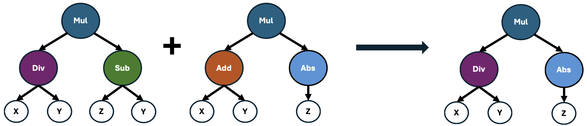
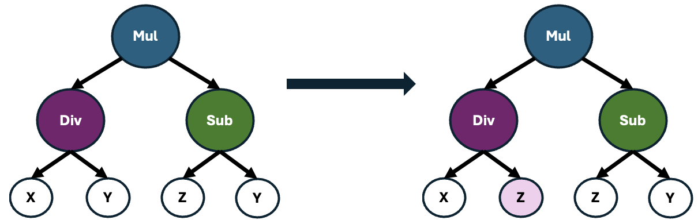

<p align="center">

</p>

<p align="center">
<i>"Because feature engineering should be a science, not an art."</i>
</p>

<div align="center">

  <a href="">[](https://pypi.org/project/featuristic/)</a>
  <a href="">[](https://pypi.org/project/featuristic/)</a>
  <a href="">[](https://opensource.org/licenses/MIT)</a>
  <a href='https://coveralls.io/github/martineastwood/featuristic?branch=dev'></a>
  <a href="">[](https://github.com/psf/black)</a>
  <a href="">[](https://github.com/pre-commit/pre-commit)</a>

</div>

[Featuristic](https://www.featuristic.co.uk/) uses Genetic Algorithms to automate the process of **feature engineering** and **feature selection**, enhancing the performance of machine learning models by optimizing their predictive capabilities.

See the [documentation](https://www.featuristic.co.uk/) for more detailed information.

## Installation
Install with pip

```
python3 -m pip install featuristic
```

## Understanding Genetic Feature Synthesis

Featuristic uses symbolic regression to intelligently derive interpretable mathematical formulas, which are then used to create new features from your dataset.

Initially, Featuristic creates a diverse population of formulas using fundamental mathematical operators such as `add`, `subtract`, `sin`, `tan`, `square`, `sqrt`, and more.

For instance, a formula generated by Featuristic might look like this: `(square(feature_1) - abs(feature_2)) * feature_3`.

Next, Featuristic assesses the importance of these formulas by quantifying how well they correlate with the target variable. Those formulas yielding features with the strongest correlations are then selected and recombined using a genetic algorithm to produce offspring, as illustrated below.



These offspring may also undergo point mutations, which causes alterations to random operators within the formula. This process introduces slight variations to the formulas, enhancing the diversity of the population and potentially leading to the discovery of novel and more effective feature representations.



This iterative process continues across multiple generations, continually refining the population of formulas with the goal of generating features that exhibit strong correlations with the target variable.

## Example

Below is an example of using Featuristic's Genetic Feature Synthesis (GFS) to perform automated feature engineering. We'll start off by downloading the well known `cars` dataset from the UCI Machine Learning Repository and split it into training and testing sets. The training set will be used to train our model, while the testing set will remain unseen during the training process and will serve as an independent dataset to evaluate the model's performance.

```python
from sklearn.linear_model import LinearRegression
from sklearn.model_selection import train_test_split, cross_val_score
from sklearn.metrics import mean_absolute_error
import featuristic as ft
import numpy as np

np.random.seed(8888)

X, y = ft.fetch_cars_dataset()

X_train, X_test, y_train, y_test = train_test_split(X, y, test_size=0.3)
```

Next, we'll initiate the Genetic Feature Synthesis process. We've configured the genetic algorithm to synthesize 5 new features for us. This entails evolving a population consisting of 200 individuals iteratively over 100 generations. To ensure optimal performance, we've set the genetic algorithm to halt early if it fails to improve upon the best feature identified within 25 generations. Additionally, for enhanced computational efficiency, we've designated n_jobs as -1, enabling concurrent execution across all available CPUs on our computer.

```python
synth = ft.GeneticFeatureSynthesis(
    num_features=5,
    population_size=200,
    max_generations=100,
    early_termination_iters=25,
    parsimony_coefficient=0.05,
    n_jobs=-1,
)

synth.fit(X_train, y_train)
```

We can call the `transform` function to generate a dataframe containing our new features. By default, the `GeneticFeatureSynthesis` class will return both the original features and the newly synthesised features. However, we return just the new features by setting the `return_all_features` argument to `False` when we create the class. We can also combine both the `fit` and `transform` steps into one step by calling `fit_transform` instead.

```python
generated_features = synth.transform(X_train)

print(generated_features.head())
```

|    |   displacement |   cylinders |   horsepower |   weight |   acceleration |   model_year |   origin |   feature_0 |   feature_1 |   feature_3 |   feature_2 |   feature_4 |
|---:|---------------:|------------:|-------------:|---------:|---------------:|-------------:|---------:|------------:|------------:|------------:|------------:|------------:|
|  0 |             89 |           4 |           62 |     2050 |           17.3 |           81 |        3 |    0.673279 | -0.00987805 |    0.566434 |   -0.917052 |    0.536626 |
|  1 |            318 |           8 |          150 |     4077 |           14   |           72 |        1 |    0.133744 | -0.00220751 |    0.324324 |   -0.226914 |    0.318668 |
|  2 |            383 |           8 |          170 |     3563 |           10   |           70 |        1 |    0.144654 | -0.0024558  |    0.291667 |   -0.183216 |    0.287549 |
|  3 |            260 |           8 |          110 |     4060 |           19   |           77 |        1 |    0.153605 | -0.00237069 |    0.411765 |   -0.29502  |    0.400227 |
|  4 |            318 |           8 |          140 |     4080 |           13.7 |           78 |        1 |    0.156848 | -0.00238971 |    0.357798 |   -0.245131 |    0.350213 |

Our newly engineered features currently have generic names. However, since Featuristic synthesizes these features by the applying mathematical expressions to the data, we can look at the underlying formulas responsible for each feature's creation.

```python
info = synth.get_feature_info()
print(info["formula"].iloc[1])
```

```
(-(((model_year / (weight + cylinders)) + sin((weight / weight)))) + -(abs(model_year)))
```

Following the synthesis of our new features, we can now use another genetic algorithm for [feature selection](https://en.wikipedia.org/wiki/Feature_selection). This process sifts through all our features to identify the subset that optimally contributes to predictive performance while minimizing redundancy.

To do this, we define a custom objective function that the Genetic Feature Selection algorithm will use to quantify how well each subset of features predicts the target. Please note that the function should return a value to minimize so a smaller value is better. If you want to maximize a metric, you should multiply the output of your objective_function by -1, as shown in the example below.

```python
def objective_function(X, y):
    model = LinearRegression()
    scores = cross_val_score(model, X, y, cv=3, scoring="neg_mean_absolute_error")
    return scores.mean() * -1
```

Next, we set up the Genetic Feature Selector. We've configured the genetic algorithm to evolve a population consisting of 200 individuals iteratively over 100 generations. To ensure optimal performance, we've set the genetic algorithm to halt early if it fails to improve upon the best feature set identified within 25 generations. Additionally, for enhanced computational efficiency, we've set n_jobs as -1, enabling concurrent execution across all available CPUs on our computer.

```python
selector = ft.GeneticFeatureSelector(
    objective_function,
    population_size=200,
    max_generations=100,
    early_termination_iters=25,
    n_jobs=-1,
)

selector.fit(generated_features, y_train)

selected_features = selector.transform(generated_features)
```

Let's print out the selected features to see what the Genetic Feature Selection algorithm kept. You can see below that featuristic has kept four of the original features ("displacement", "horsepower", "weight" and "origin") plus four of the features created via the Genetic Feature Synthesis.

```python
print(selected_features.head())
```

|    |   displacement |   horsepower |   weight |   origin |   feature_0 |   feature_1 |   feature_3 |   feature_2 |
|---:|---------------:|-------------:|---------:|---------:|------------:|------------:|------------:|------------:|
|  0 |             89 |           62 |     2050 |        3 |    0.673279 | -0.00987805 |    0.566434 |   -0.917052 |
|  1 |            318 |          150 |     4077 |        1 |    0.133744 | -0.00220751 |    0.324324 |   -0.226914 |
|  2 |            383 |          170 |     3563 |        1 |    0.144654 | -0.0024558  |    0.291667 |   -0.183216 |
|  3 |            260 |          110 |     4060 |        1 |    0.153605 | -0.00237069 |    0.411765 |   -0.29502  |
|  4 |            318 |          140 |     4080 |        1 |    0.156848 | -0.00238971 |    0.357798 |   -0.245131 |

Now that we've selected our features, let's see whether they actually help our model's predictive performance on our test data set. We'll start off with the original features as a baseline.

```python
model = LinearRegression()
model.fit(X_train, y_train)
preds = model.predict(X_test)
original_mae = mean_absolute_error(y_test, preds)
print(original_mae)
```

```
2.5888868138669303
```

And now, let's see how the model performs with our synthesised feature set.

```python
model = LinearRegression()
model.fit(selected_features, y_train)
test_features = selector.transform(synth.transform(X_test))
preds = model.predict(test_features)
featuristic_mae = mean_absolute_error(y_test, preds)
print(featuristic_mae)
```

```
2.1729482398016042
```

```python
print(f"Original MAE: {original_mae}")
print(f"Featuristic MAE: {featuristic_mae}")
print(f"Improvement: {round((1 - (featuristic_mae / original_mae))* 100, 1)}%")
```

```
Original MAE: 2.5888868138669303
Featuristic MAE: 2.1729482398016042
Improvement: 16.1%
```

The new features generated / selected by the Genetic Feature Synthesis have successfully reduced our mean absolute error &#128512;
